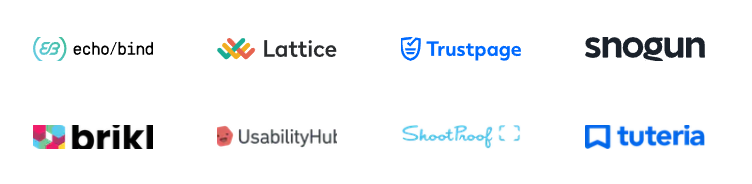
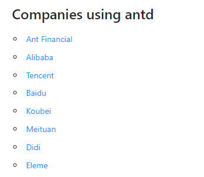

# React UI ライブラリの比較

## npm trends からそれぞれを人気度を見る

青が`Chakra UI`, 緑が`Ant-Design`, オレンジが`Material UI`です
直近 2 年間の人気度を表しています。
圧倒的人気は`Material UI`で一番人気がないのは`Chakra UI`という結果になりました

## npm stats で比較してみる

### stars

1. `ant-design`
2. `material-ui`
3. `chakra-ui`

という順位になりました、`stars`が多いということは情報を常にキャッチアップしたい人が多いということの指標になります。

 

### issues

1. `ant-design`
2. `material-ui`
3. `chakra-ui`

issues の数は議論が活発であることがわかりますが、これはバグが原因のものが多々あるので多ければいいというものでもない気がしています。

 

### updated

1. `ant-design`
2. `chakra-ui`
3. `material-ui`

更新頻度（2022.1.12 日現在）が多いのは`ant-design`でした
バグの修正等が頻繁に行われている証拠です、ただし issues が関連していて更新頻度が早いのはいい面も悪い面もありそうです。

悪い面としては破壊的な変更が行われた時に対応するのが大変だったり、既知のバグであるか判断が難しい面です。
逆に更新頻度が少ないということは安定しているという証拠でもあると思います。

 

### size

1. `material-ui`
2. `chakra-ui`
3. `ant-design`

最少が`material-ui`でした。
`ant-design`の 3 分の１のサイズになっており非常に軽いライブラリだと思います。

 

## 使用企業

### material-ui

 

### chakra-ui

 

### ant-design

やはり`material-ui`が強いです。
`chakra-ui`も多くの企業に使われいて今後期待です
`ant-design`は中国製というのもあって中国の名だたる大企業が使用しています

 

## 結論

**React-Typescript && material-ui を利用することに決めました。**

なぜ`material-ui`に決めたのかというと

- 圧倒的に日本語、英語の情報量が多い
- Google が推奨しているマテリアルデザインベースで開発されているので Google フレンドリーであること

- ドキュメントが充実している。

以上が採用理由です。
その他にも考慮しようと思っていた要素がありますが、今後のメンテナンス性を考えると`material-ui`がベターなのかなと思いました。
あとコンポーネントの量が多いので開発速度も上がると思っています。
