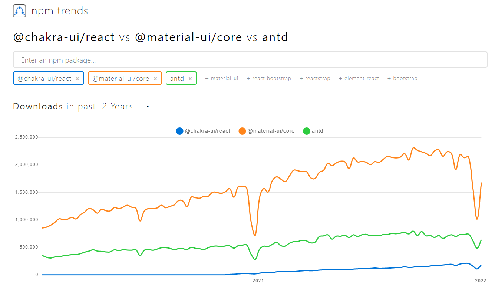
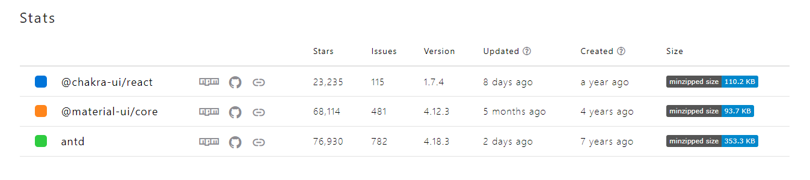

# React UI ライブラリの比較

## npm trends からそれぞれを人気度を見る

青が`Chakra UI`, 緑が`Ant-Design`, オレンジが`Material UI`です
直近2年間の人気度を表しています。
圧倒的人気は`Material UI`で一番人気がないのは`Chakra UI`という結果になりました

## npm statsで比較してみる

#### stars

  1. `ant-design`
  2. `material-ui`
  3. `chakra-ui`

という順位になりました、starsが多いということは常に情報をキャッチアップしたい人が多いということの指標になるので重要な選定基準になります

#### issues

1. `ant-design`
2. `material-ui`
3. `chakra-ui`

issuesの数は議論が活発であることがわかりますが、これはバグが原因のものが多々あるので多ければいいというものでもない気がしています

#### updated

1. `ant-design`
2. `chakra-ui`
3. `material-ui`

更新頻度（2022.1.12日現在）が多いのは`ant-design`でした
バグの修正等が頻繁に行われている証拠です、ただしissuesが関連していて更新頻度が早いのはいい面も悪い面もありそうです。

悪い面としては破壊的な変更が行われた時に対応するのが大変だったり、既知のバグであるか判断が難しい面です。
逆に更新頻度が少ないということは安定しているという証拠でもあると思います。

